# HireHub

HireHub is a complete job requirtment and hiring solution. This application offers solutions best focused in simpliflying hiring process. The features of this site are:

⚪ Allows recruiters to post for job vaccancies

⚪ Allows Candidates to apply for the post

⚪ Allows for the shortlisting of candidates

⚪ Notification for various stages of application

⚪ Real time chat with the candidates

⚪ Events And Todos for Users


## Screenshots

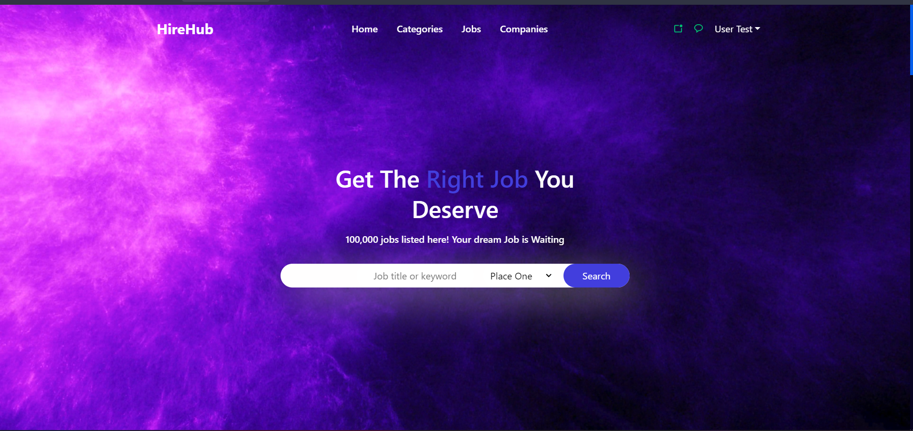
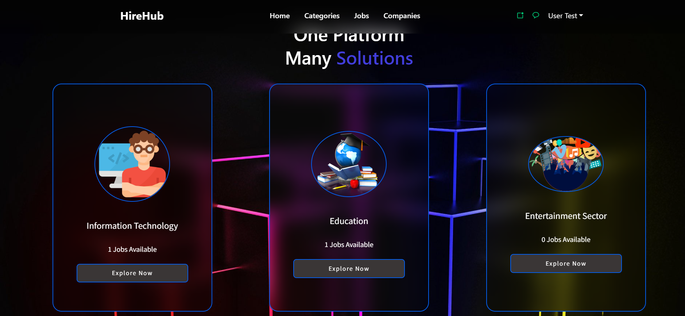


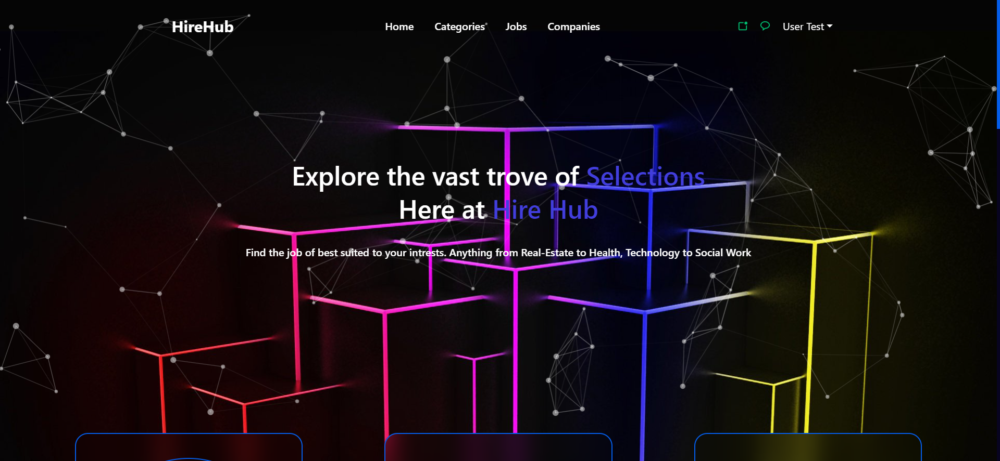

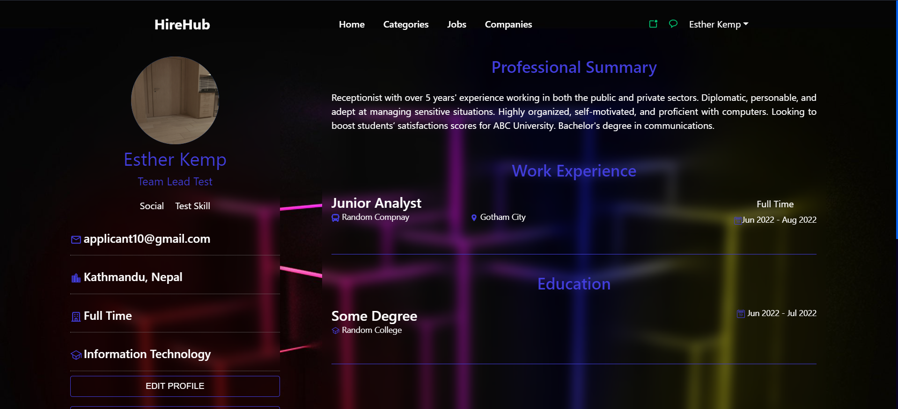
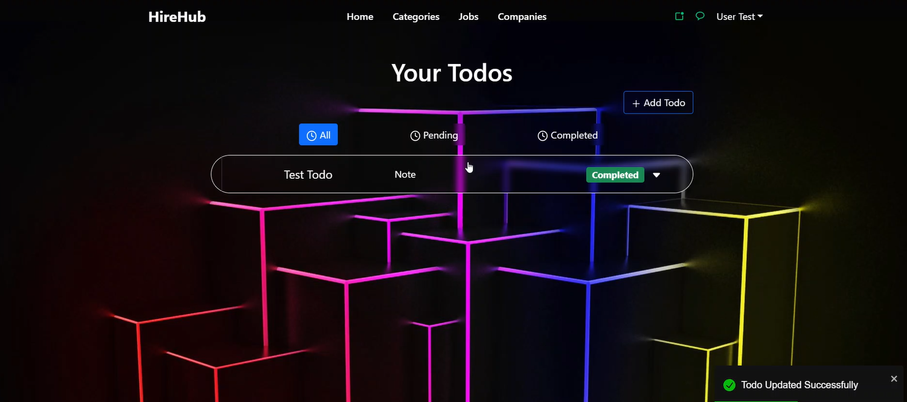

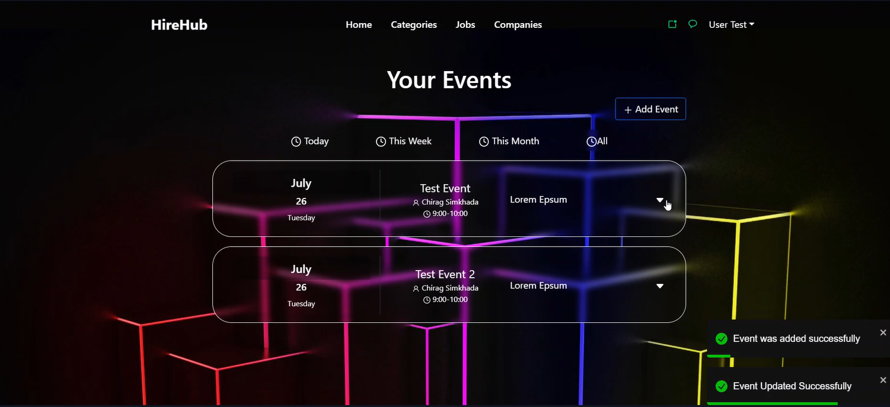
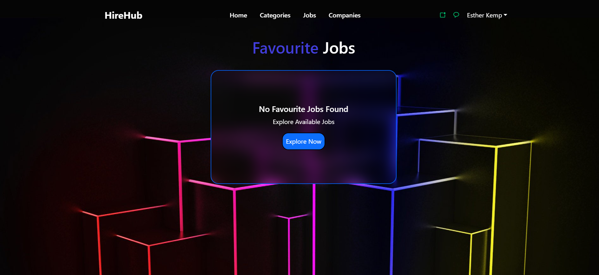
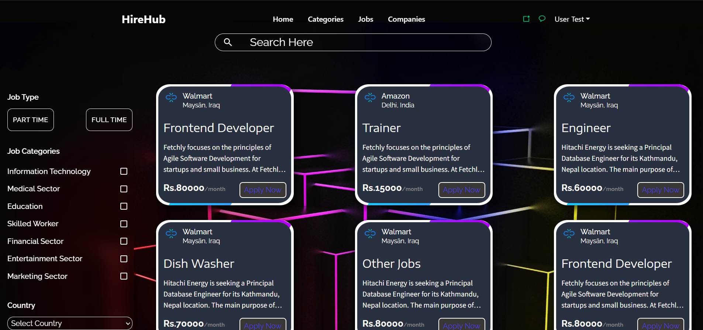
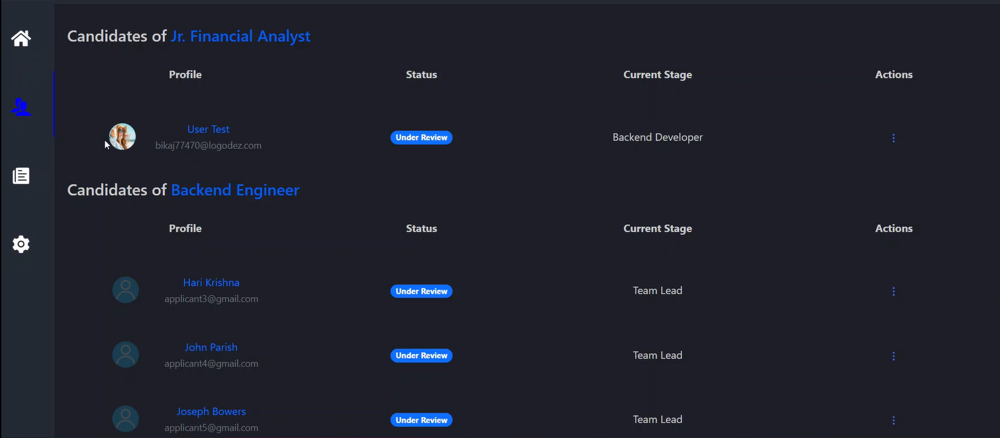
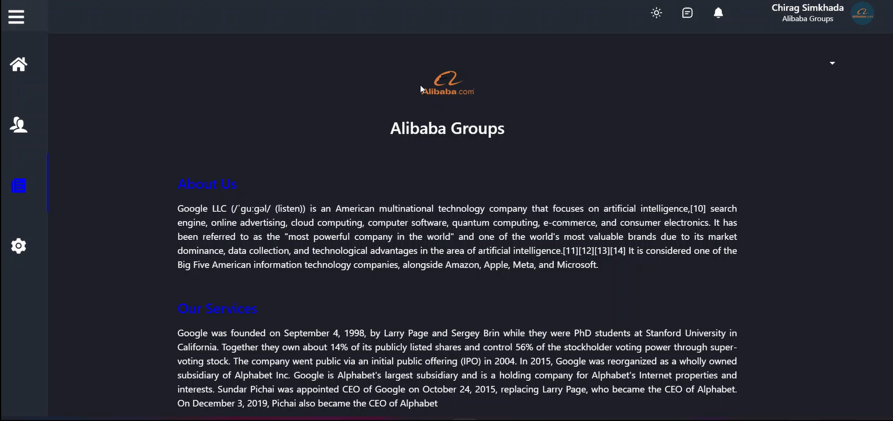
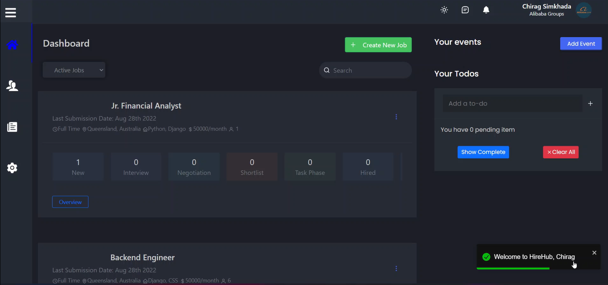
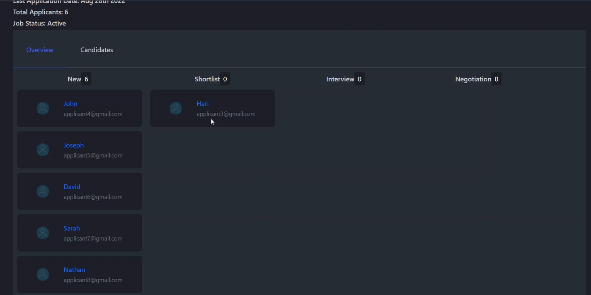
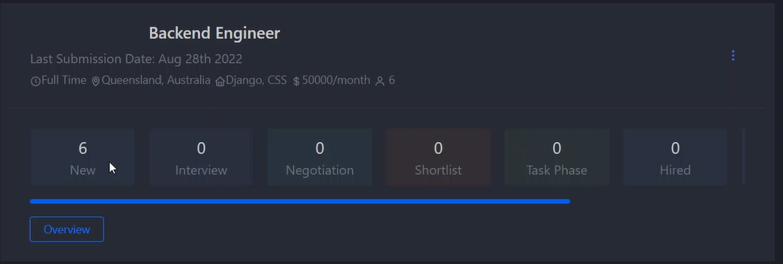
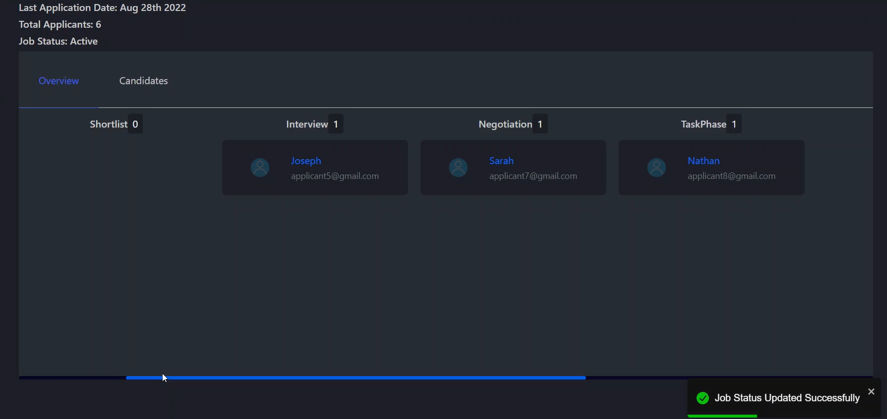
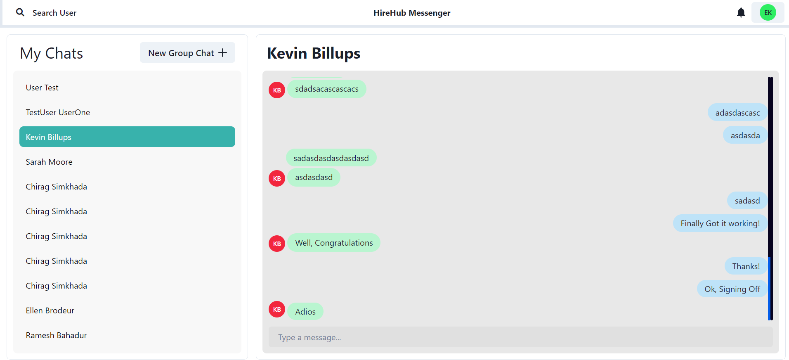

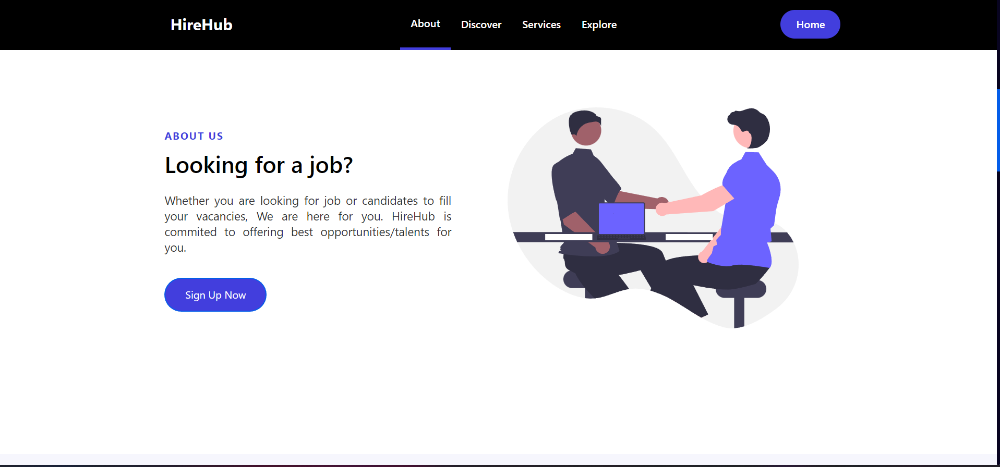

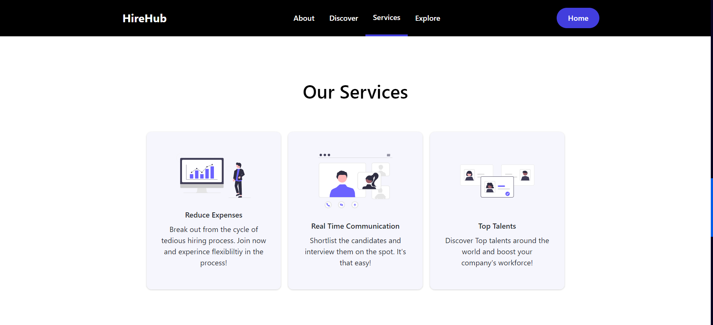
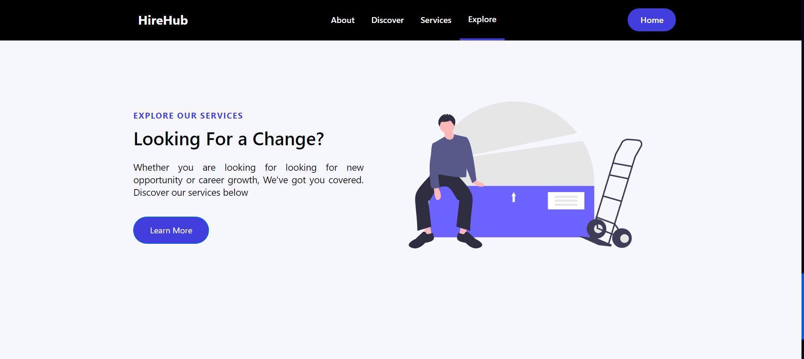
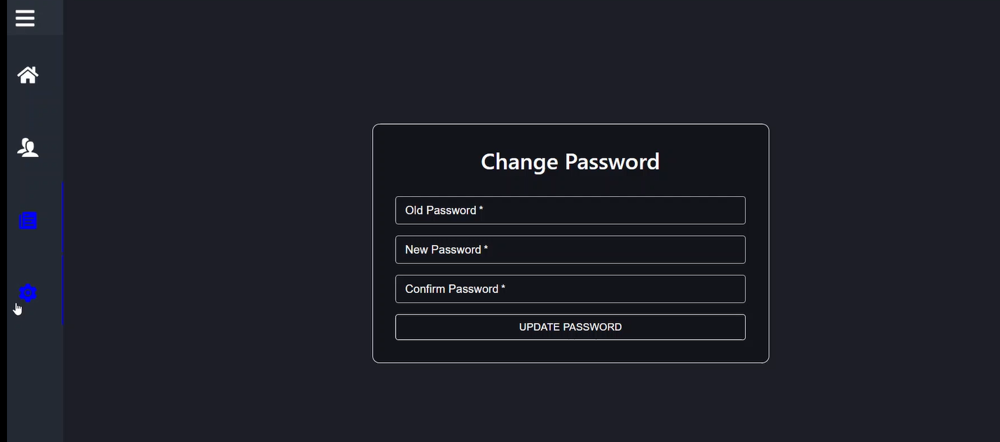


## Authors

- [@chirag123-bit](https://www.github.com/Chirag123-bit)


## Run Locally

Clone the project

```bash
  git clone https://github.com/Chirag123-bit/HireHub-Frontend.git
```

Go to the project directory

```bash
  cd HireHub-Frontend
```

Install dependencies

```bash
  npm install
```

Start the server

```bash
  npm start
```


## Running Tests

To run tests, run the following command

```bash
  npx jest
```

